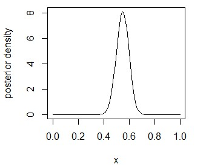

## Frequentist
Suppose we toss a coin and guess it is head or tail. Then, P(H) indicates the probability of getting the head side. In frequentist view, we see relative frequency of events. That is when we toss the coin infinite number of times and get head side half of times, then we can define P(H) equals 1/2. The true P(H) value is unknown but a fixed constant. Thus, in the frequentist paradigm, it tries to be objective in defining probabilities.

### Binominal Example
Now, we want to know whether a coin is fair or not, which is kind of the same question above. As a result of tossing the coin 100 times, we get 55 heads and 45 tails. Based on the central limit theorem, the summed number of the head(x) will approximately follow a normal distribution.
\\[ \sum_{i=1}^{100} x_i \sim N(100p, 100p(1-p))  \\] 
That is, the 95% confidence interval would be $$  100p \pm 1.96 \sqrt{100p(1-p)}$$.
Since we observed head side 55 times, $$ \hat p(H)= 0.55 $$ .
Therefore, the confidence interval is 45.2 to 65.7. That p is in the interval 0.452 to 0.657. As 0.5 is in the interval, we can say the coin is fair. 

But what does the 95% confidence interval mean here? <br/>
If we repeat this 100 tossing event for an infinite number of times or a large number of times, each time we get the confidence interval. In frequentist view, for 95% of the intervals will contain the true value of p. In other words, for each interval, the true value of p either belongs to the interval or not.

## Bayesian
On the contrary, the Bayesian paradigm defines probabilities from a personal perspective. For instance, P(H) may be different, if you have different information. That is P(H) would be a random variable between 0 and 1, and, based on your data of tossing the coin, you update the probability of getting head. For more generalized form, we use $$\theta$$ instead of P(H). Now, we use Bayes' rule to infer the probability of getting head side instead.

### Bayes' Rule
Here is how we derive posterior distribution from the Bayesian model:
\\[ p(\theta |y) = \frac{p(\theta, y)}{p(y)} = \frac{p(\theta)p(y|\theta)}{p(y)} \\]
$$p(y)$$ is called *normalizing factor* as it makes $$p(\theta|y)$$ is a density in $$\theta$$.

### Notation
y = *data* (observed). <br /> 
$$\theta$$ = *parameter*  <br /> 
In Bayesian analysis, $$\theta$$ is considered to be random. It represents uncertainty about its value.

\\[ p(\theta) \\]
*prior distribution*: marginal distribution of &theta;. Our state of knowledge(uncertainty) prior to observing y.

\\[ p(y|\theta) \\]
*sampling distribution*: conditional distribution of y given $$\theta$$. How the data would be generated when $$\theta$$ is given.

\\[ p(\theta | y) \\]
*posterior distribution*: conditional distribution of $$\theta$$ given y.

### Binomial Example
Consider the same coin tossing event above. <br/>
Now, $$\theta$$ = proportion of head from the reulst of tossing coin <br/>
$$ n $$= size of a random sample from population, which is 100 in this case <br/>
$$ y $$ = number in sample which shows head side <br/>
And we suppose sampling distribution(for a large population):
\\[ y | \theta \sim Bin(n, \theta) \\]
Sampling density: <br/>
$$ p(y|\theta) = 
\begin{pmatrix} n \\ y \end{pmatrix}
\theta^y (1-\theta)^{n-y}, y=0, ..., n
$$

As the result of tossing a coin 100 times, we get head side 55 times, which indiciates $$ \theta = 0.55 $$.  <br/>
The likelihood:  <br/>
$$ p(y = 55|\theta) = \begin{pmatrix} 100 \\ 55 \end{pmatrix} \theta^{55} (1-\theta)^{100-55} $$ <br/>
$$ \propto \theta^{55} (1-\theta)^{45} $$

We can make a prior for $$ \theta $$ by guess, or choose a uniform prior, which is non-informative.
\\[ \theta \sim U(0,1) \\]

Now, we can apply Bayes' rule above, and infer the posterior density.
\\[ p(\theta | y= 55) \propto 1*\theta^{55}(1-\theta)^{45} \\]
\\[ \propto \theta^{55} (1-\theta)^{45}, 0 <\theta < 1 \\]

We can avoid calculating the normalizing factor $$ p(y) $$ by finding similar density function, Beta. <br/>
\\[ \frac{\gamma(\alpha + \beta)}{\gamma(\alpha)\gamma(\beta)} \theta^{\alpha-1} (1-\theta)^{\beta -1}
\propto \theta^{\alpha-1} (1-\theta)^{\beta-1}
 \\]
 Since alpha and beta is just constants, we can omit gamma function. When we compare this Beta function with above posterior, we can identify the posterior for theta tiven y equals 55 with alpha equals 56, and beta equals 46. By directly looking at the beta table, we can avoid calculating calculus. 
\\[ \theta | y = 55 \sim \beta(\alpha = 56, \beta = 46) \\]

Plotting this posterior:
``` r
curve(dbeta(x, 56, 46), 0, 1, ylab=" Density")
```

<p align="center"> 

</p>

When flat prior used, most posterior probability ranges around 0.4 to 0.7.

Similar to frequentist confidence interval, we can use posterior credible interval, which indicates the interval containing $$ \theta $$ with specified posterior probability. One of ways to get a posterior interval is calculate $$ 100(1-\alpha)% $$ ranging between $$ \alpha /2 $$ and $$ 1-\alpha /2 $$.
This is called a central posterior interval. <br/>
Throughout simulating Beta distribution, we can get the posterior interval.
``` r
posterior.samples = rbeta(1000, 56, 46)
quantile(posterior.samples, c(0.05/2, 1-0.05/2))

2.5%     97.5%
0.4520435 0.6466100
```

Considering that confidence interval was 0.452 to 0.657, both give similar results. However, the meaning is different. Unlike frequentist which speaks of interval in repeated practice, the posterior interval can be directly regarded as the probability of having the parameter.

### Reference
- STAT 578: Advanced Bayesian Modeling by Professor Trevor Park
- Bayesian Statistics: From Concept to Data Analysis by Professor Herbert Lee on Coursera